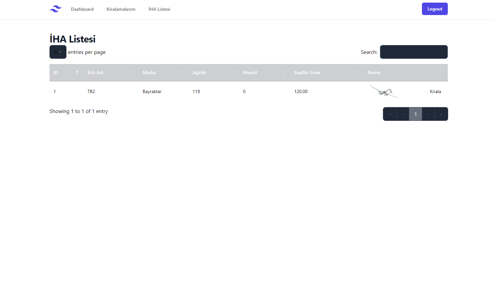

# IHA Kiralama Sistemi

## Proje Gereksinimleri
* Docker (Opsiyonel)
* Docker Compose (Opsiyonel)
* PostgreSQL (Opsiyonel)
* Python 3.8
* Django
* django-filter
* djangorestframework
* drf-yasg
* psycopg2
* psycopg2-binary
* Pillow
* pytest
* pytest-django
* python-dotenv
* django-widget-tweaks
* django-adminlte3

## Proje Kurulumu
1. Projeyi klonlayın
```bash
git clone git@github.com:muhammedsaidckr/iha-kiralama.git
```

2. Proje dizinine girin
```bash
cd iha-kiralama
```

## Docker ile
1. Docker Compose ile projeyi başlatın
```bash
docker-compose up --build
```

2. Superuser oluşturun
```bash
docker exec dronerental-web python manage.py createsuperuser
```

3. Testleri çalıştırın
```bash
docker exec dronerental-web python manage.py test
```

## Proje Kurulumu Manuel


1. Virtual Environment oluşturun
```bash
python -m venv venv
```

2. Virtual Environment'ı aktif edin
```bash
source venv/bin/activate
```

3. Gerekli paketleri yükleyin
```bash
pip install -r requirements.txt
```

## Proje Resimleri



